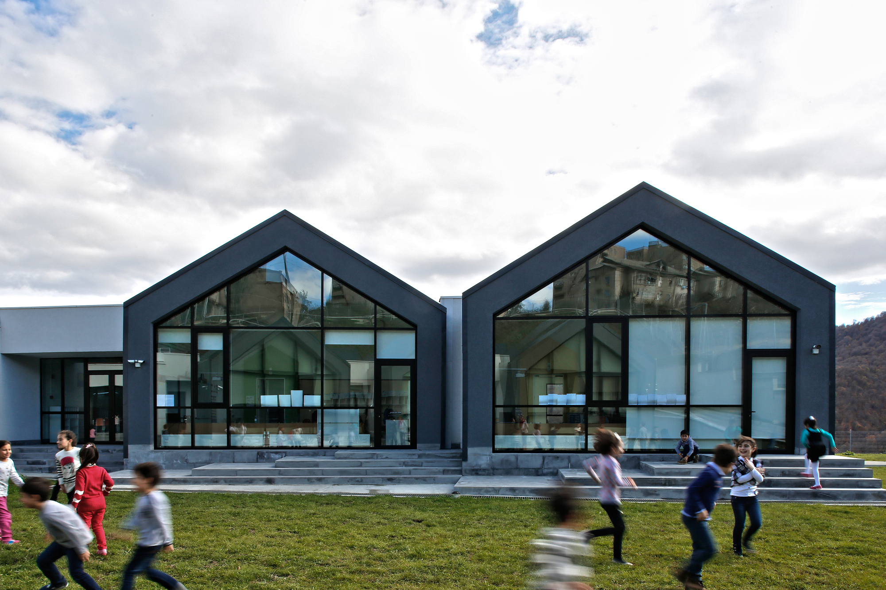

# Իմ մասին

Բարև՛։ Ես Յանան եմ։ Սովորում եմ Դիլիջանի կենտրոնական դպրոցում 2025 թվականից։ Ծնվել եմ Վանաձորում։

###  Հետաքրքրություններ և կրթություն
Ինձ հետաքրքրում են այն առարկաները, որոնք օգնում են հասկանալ ինչպես բնությունը, այնպես էլ թվերի աշխարհը։ Իմ հիմնական հետաքրքրություններն են կենսաբանությունը, մաթեմատիկան և վիճակագրությունը։ Տիրապետում եմ հայերենին, ռուսերենին և անգլերենին, իսկ այժմ նաև սովորում եմ ֆրանսերեն։

Բացի գիտությունից և մաթեմատիկայից,հետաքրքրվում եմ արվեստով, ճարտարապետությամբ և դիզայնով։ Ինձ հետաքրքիր է ուսումնասիրել, թե ինչպես կարող են ստեղծագործական գաղափարներն ու տեխնոլոգիաները միավորվել և վերածվել նոր ու օգտակար նախագծերի։

###  Իմ ճանապարհը Ֆաբլաբում
2026 թվականին ես առաջին անգամ ծանոթացա Դիլիջանի Ֆաբլաբի հետ, երբ նախագծային ուսուցման շրջանակում որպես նախագիծ ընտրեցի թվային արտադրությունը։ Մեր Ֆաբլաբը գտնվում է հենց Դիլիջանի կենտրոնական դպրոցում։ Ինձ հատկապես հետաքրքրում է այն գործընթացը, երբ գաղափարը վերածվում է իրական, ֆիզիկական նախագծի։

###  Նպատակներ
Ես հետաքրքրված եմ տարբեր ոլորտներով և ցանկանում եմ շարունակել ուսումնասիրել գիտության, տեխնոլոգիայի, ստեղծագործության և դիզայնի միջև կապերը։