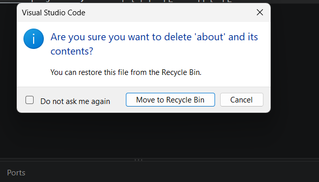
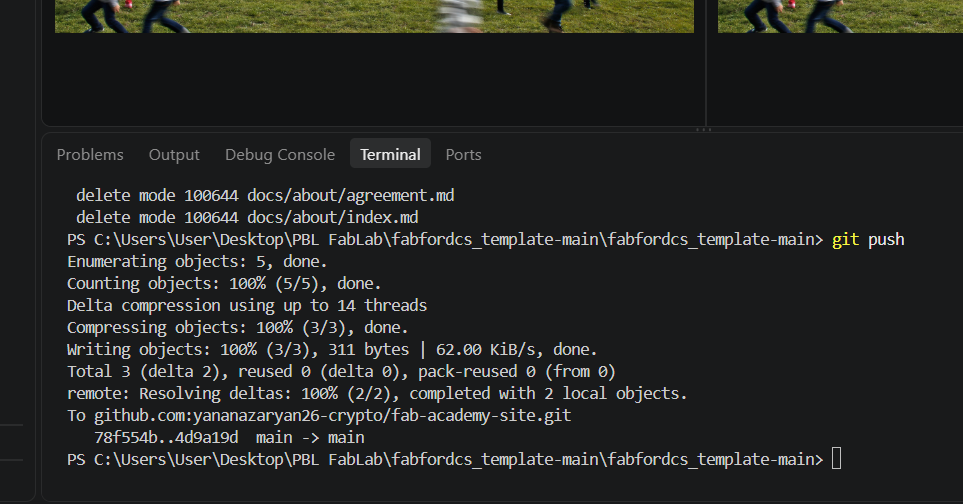
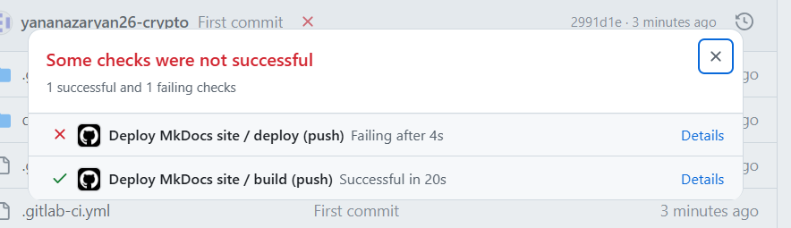
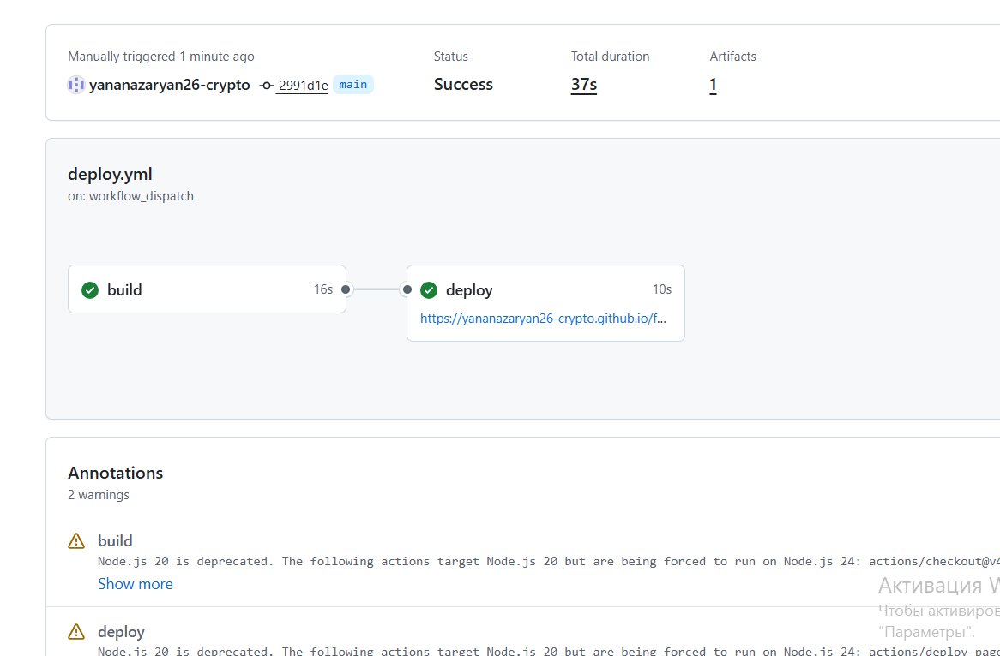

# Շաբաթ 1-2: Կայքի ստեղծման և նախագծերի կառավարման հիմունքներ

Այս ուղեցույցում ներկայացված է Նախագծային ուսումնառության - թվային արտադրության շրջանակում անհատական վեբ կայքի ստեղծման ամբողջական գործընթացը։ Այն նախատեսված է սկսնակների համար և նպատակ ունի հստակ քայլերով ցույց ստալ զրոյից մինչև գործող կայք անցնող ճանապարհը։

---

## 1. Օգտագործվող գործիքներ և միջավայր

Աշխատանքն իրականացնելու համար անհրաժեշտ են հետևյալ տեխնիկական միջոցները.
* **Visual Studio Code (VS Code):** Կոդերի և տեքստերի խմբագրման հիմնական ծրագիրը։
* **MkDocs (Material թեմայով):** Ստատիկ վեբ կայքեր գեներատոր, որը թույլ է տալիս Markdown ձևաչափով գրված տեքստերը վերածել ժամանակակից դիզայնով կայքի։
* **Git և GitHub:** Տարբերակների կառավարման համակարգ և առցանց հարթակ։ Git-ը հետևում է կոդի փոփոխություններին տեղային համակարգչում, իսկ GitHub-ն ապահովում է ֆայլերի պահպանումն ու կայքի հասանելիությունը համացանցում։

---

## 2. Արհեստական բանականության դերը և օգտագործված հարցումները (Prompts)

Քանի որ այս ոլորտում նոր էի և ամեն ինչ զրոյից էի սովորում, աշխատանքի ընթացքում օգտվել եմ արհեստական բանականությունից: ԱԲ-ն օգնել է ինձ հասկանալ տեխնիկական հասկացությունները, գրել կոդեր և լուծել առաջացած խնդիրները։ 

Ահա այն հիմնական հարցումները (պրոմտերը), որոնք ուղղել եմ ԱԲ-ին․
1. *«Ինչպե՞ս հասկանալ կայքի կառուցվածքը և ստեղծել նոր էջեր docs պապկայում»* – կառուցվածքային ճիշտ դասավորության համար։
2. *«Ինչպե՞ս է աշխատում SSH բանալին և ինչպես այն կապել GitHub-ի հետ»* – անվտանգ միացման և առանց գաղտնաբառի մուտքի կարգավորման համար։
3. *«Ինչպե՞ս ճիշտ տեղադրել պատկերները կայքում Markdown միջոցով»* – նկարների ցուցադրման համար։
4. *«Ինչպե՞ս լուծել տերմինալում հանդիպող Git-ի սխալները և ճիշտ կատարել push»* – տերմինալային աշխատանքային հոսքը (workflow) հստակեցնելու համար։

---

## 3. Աշխատանքային քայլերի հաջորդականություն

### Քայլ Ա. Ֆայլային համակարգի կարգավորում
* Կայքի բոլոր բովանդակային ֆայլերը գտնվում են **`docs`** գլխավոր պապկայում։
* Հիմնական էջն անվանվում է `index.md`, իսկ լրացուցիչ էջերը (օրինակ՝ անձնական տեղեկատվությունը) ստեղծվում են որպես առանձին `.md` ֆայլեր։

### Քայլ Բ. Պատկերների տեղադրում
1. `docs` պապկայի ներսում ստեղծվում է **`images`** ենթապապկա։
2. Անհրաժեշտ պատկերները տեղափոխվում են այդ պապկա։
3. Էջում դրանք ցուցադրելու համար կիրառվում է համապատասխան շարահյուսությունը։

---

## 4. Հանդիպած խնդիրներ (Errors) և դրանց լուծումները

Աշխատանքային պրոցեսում, քանի որ նոր էի սովորում գործիքների հետ աշխատել, հանդիպել եմ մի քանի տեխնիկական խնդիրների և սխալների։ Ահա դրանք և իմ կողմից տրված լուծումները․

1. **Խնդիր: Ֆայլային կառուցվածքի շփոթություն (Folders vs Files)**
   - **Նկարագրություն:** Սկզբում սխալմամբ ստեղծել էի առանձին պապկա (folder) էջի փոխարեն, ինչի հետևանքով կայքում համապատասխան էջը չէր բացվում կամ սխալ էր աշխատում։
   - **Լուծում:** Արհեստական բանականության (ԱԲ) օգնությամբ հասկացա, որ `docs` պապկայի ներսում էջերը պետք է լինեն ուղղակի `.md` ֆայլեր։ Հեռացրեցի սխալ պապկան և ստեղծեցի ճիշտ ֆայլային անունով `.md` ֆայլ։

   
   *Նկար 2. Սխալ պապկայի և ճիշտ ֆայլային կառուցվածքի տարբերությունը VS Code-ում:*

2. **Խնդիր: Տերմինալի և Git հրամանների անծանոթություն**
   - **Նկարագրություն:** Սկզբում դժվար էր հասկանալ, թե ինչպես պետք է ճիշտ գրել հրամանները տերմինալում և ինչպես ուղարկել փոփոխությունները GitHub։
   - **Լուծում:** Քայլ առ քայլ ուսումնասիրեցի հիմնական հրամանների տրամաբանությունը (`git add .`, `git commit -m "..."`, `git push`), ԱԲ-ի հարցումների միջոցով պարզեցի յուրաքանչյուր քայլի նշանակությունը և հաջողությամբ կարգավորեցի աշխատանքային հոսքը։

   
   *Նկար 3. Տերմինալում Git հրամանների հաջող կատարումը և փոփոխությունների ուղարկումը:*

3. **Խնդիր: SSH բանալիների և անվտանգ կապի կարգավորում**
   - **Նկարագրություն:** GitHub-ի հետ անվտանգ կապ հաստատելու և առանց գաղտնաբառի մուտքերի աշխատելու համար անհրաժեշտ էր ճիշտ ստեղծել ու տեղադրել SSH բանալիները։
   - **Լուծում:** Հետևելով պաշտոնական ուղեցույցներին և օգտվելով ԱԲ-ի խորհուրդներից՝ տերմինալում ստեղծեցի ed25519 տիպի բանալի (`ssh-keygen -t ed25519`), այն տեղադրեցի իմ GitHub հաշվի կարգավորումներում, ինչի շնորհիվ կապը հաջողությամբ հաստատվեց։

4. **Խնդիր: Նկարների ցուցադրման սխալներ (Broken Images)**
   - **Նկարագրություն:** Սկզբում նկարները տեղադրելիս կայքում դրանք չէին երևում, քանի որ հասցեները (paths) կամ պապկաների անունները սխալ էին նշված։
   - **Լուծում:** Ստեղծեցի հստակ `images` ենթապապկա `docs` պապկայի ներսում, տեղափոխեցի նկարները այնտեղ և Markdown շարահյուսությամբ ճիշտ հղեցի դրանք։

5. **Խնդիր: Տերմինալի «Not a git repository» սխալը կրկնակի պապկաների պատճառով**
   - **Նկարագրություն:** Աշխատանքի սկզբում տերմինալում Git հրամաններ գրելիս ստացել էի սխալ առ այն, որ պանակը Git շտեմարան (repository) չէ։ Պատճառն այն էր, որ նախագծի պանակը բացվել էր կրկնակի ներդրված շտեմարանային կառուցվածքով։
   - **Լուծում:** Վերաբացեցի ճիշտ աշխատանքային պանակը VS Code-ում, ինչից հետո Git հրամաններն սկսեցին անխափան աշխատել։

6. **Խնդիր: GitHub Actions-ի «Deploy» փուլի սխալ (Some checks were not successful)**
   - **Նկարագրություն:** GitHub ուղարկելուց (push) հետո GitHub Actions համակարգում `build` փուլը հաջողությամբ աշխատել էր, սակայն `deploy (push)` փուլում տեղի էր ունեցել ձախողում, ինչի պատճառով կայքը ավտոմատ չէր թարմացվում առցանց։
   - **Լուծում:** Actions ներդիրում ուսումնասիրեցի սխալի մանրամասները, վերստուգեցի կարգավորումները, որից հետո ձեռքով կամ կրկնակի push անելով հասա նրան, որ բոլոր ստուգումները ավարտվեցին հաջողությամբ, և կայքը գործարկվեց։

   *Ստորև բերված նկարներում երևում է սկզբնական սխալը GitHub Actions-ում և հետագա հաջողված գործարկումը․*
   
   
   *Նկար 4. GitHub Actions-ում հանդիպած սխալի (Failing) պատկերը:*

   
   *Նկար 5. GitHub Actions-ի հաջողված ավարտը (Success) և կայքի թարմացումը:*

